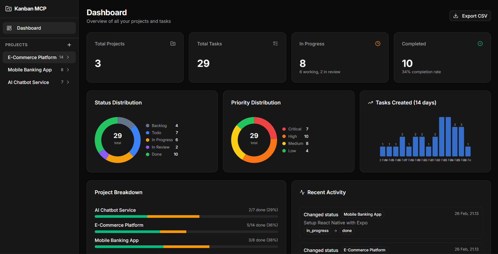
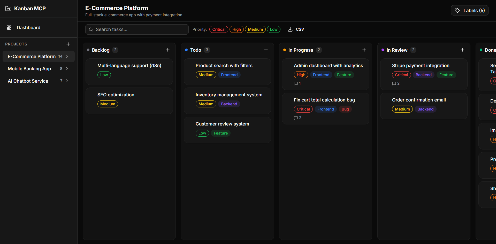

# Kanban MCP

Papan Kanban lengkap dengan server [Model Context Protocol (MCP)](https://modelcontextprotocol.io/) terintegrasi, memungkinkan AI coding agent mengelola proyek dan task secara programatis.





## Daftar Isi

- [Tech Stack](#tech-stack)
- [Fitur](#fitur)
- [Memulai](#memulai)
- [Server MCP](#server-mcp)
  - [Tools yang Tersedia](#tools-yang-tersedia)
  - [Resources yang Tersedia](#resources-yang-tersedia)
  - [Jalankan Server MCP](#jalankan-server-mcp)
  - [Konfigurasi MCP Client](#konfigurasi-mcp-client)
  - [Contoh Penggunaan](#contoh-penggunaan)
- [Daftar Script](#daftar-script)
- [Struktur Proyek](#struktur-proyek)
- [Integrasi AI Agent](#integrasi-ai-agent)
  - [System Prompt](#system-prompt)
  - [Skill (Antigravity)](#skill-antigravity)
- [Lisensi](#lisensi)

## Tech Stack

| Layer       | Teknologi                   |
| ----------- | --------------------------- |
| Framework   | Next.js 15 (App Router)     |
| Bahasa      | TypeScript                  |
| Database    | SQLite + Drizzle ORM        |
| UI          | shadcn/ui + Tailwind CSS v4 |
| State       | Zustand                     |
| Drag & Drop | @dnd-kit                    |
| MCP         | @modelcontextprotocol/sdk   |

## Fitur

- **Papan Kanban** — Drag-and-drop task antar kolom Backlog, Todo, In Progress, In Review, Done
- **Dashboard** — Kartu ringkasan, donut chart (status/prioritas), bar chart tren 14 hari, breakdown per proyek
- **Sub-task** — Checklist sub-task dengan progress bar
- **Label** — Label warna kustom per proyek
- **Komentar** — Thread komentar dengan timestamp di setiap task
- **Log Aktivitas** — Riwayat lengkap perubahan task
- **Pencarian & Filter** — Pencarian real-time + filter prioritas di papan
- **Ekspor CSV** — Ekspor semua task atau per proyek
- **Dark Mode** — Aktif secara default
- **Server MCP** — 13 tools + 4 resources untuk integrasi AI agent

## Memulai

### Prasyarat

- Node.js 18+
- npm

### Instalasi

```bash
git clone https://github.com/dzikrihilman/kanban-mcp.git
cd kanban-mcp
npm install
```

### Setup Database

```bash
npm run db:generate
npm run db:migrate
```

### Jalankan Server Development

```bash
npm run dev
```

Buka [http://localhost:3000](http://localhost:3000).

## Server MCP

Server MCP mengekspos manajemen proyek dan task sebagai tools untuk AI coding agent (Claude, Cursor, Windsurf, dll).

### Tools yang Tersedia

| Tool                    | Deskripsi                               |
| ----------------------- | --------------------------------------- |
| `list_projects`         | Daftar semua proyek beserta jumlah task |
| `get_project`           | Detail proyek                           |
| `create_project`        | Buat proyek baru                        |
| `update_project`        | Perbarui field proyek                   |
| `delete_project`        | Hapus proyek beserta semua task         |
| `list_tasks`            | Daftar task (filter status/prioritas)   |
| `get_task`              | Detail task beserta komentar            |
| `create_task`           | Buat task dengan semua field            |
| `update_task`           | Perbarui task dengan logging aktivitas  |
| `delete_task`           | Hapus task                              |
| `move_task`             | Pindahkan task antar kolom              |
| `add_comment`           | Tambah komentar ke task                 |
| `search_tasks`          | Cari berdasarkan kata kunci             |
| `get_dashboard_summary` | Statistik dashboard lengkap             |

### Resources yang Tersedia

| URI                           | Deskripsi             |
| ----------------------------- | --------------------- |
| `kanban://projects`           | Semua proyek          |
| `kanban://project/{id}`       | Detail proyek         |
| `kanban://project/{id}/tasks` | Task dalam proyek     |
| `kanban://task/{id}`          | Task beserta komentar |

### Jalankan Server MCP

```bash
npm run mcp:start
```

### Konfigurasi MCP Client

Tambahkan konfigurasi berikut ke MCP client Anda:

**Claude Desktop** (`claude_desktop_config.json`):

```json
{
  "mcpServers": {
    "kanban-mcp": {
      "command": "npx",
      "args": ["tsx", "/path/absolut/ke/kanban-mcp/src/mcp-server/index.ts"]
    }
  }
}
```

**Cursor / Windsurf / Antigravity** (`mcp_config.json`):

```json
{
  "mcpServers": {
    "kanban-mcp": {
      "command": "npx",
      "args": ["tsx", "/path/absolut/ke/kanban-mcp/src/mcp-server/index.ts"]
    }
  }
}
```

> Ganti `/path/absolut/ke/kanban-mcp` dengan path absolut ke direktori proyek Anda.

### Contoh Penggunaan

Setelah dikonfigurasi, AI agent Anda bisa:

```
"Buat proyek baru bernama 'Aplikasi Saya' dan tambahkan 3 task"
"Pindahkan task X ke in_progress"
"Tampilkan ringkasan dashboard"
"Ekspor semua task ke CSV"
```

## Daftar Script

| Script                | Deskripsi                           |
| --------------------- | ----------------------------------- |
| `npm run dev`         | Jalankan server development Next.js |
| `npm run build`       | Build untuk produksi                |
| `npm run start`       | Jalankan server produksi            |
| `npm run mcp:start`   | Jalankan server MCP (stdio)         |
| `npm run db:generate` | Generate migrasi Drizzle            |
| `npm run db:migrate`  | Jalankan migrasi database           |

## Struktur Proyek

```
src/
├── app/
│   ├── api/              # Route API
│   │   ├── activity/     # Log aktivitas
│   │   ├── analytics/    # Data analitik
│   │   ├── comments/     # CRUD komentar
│   │   ├── dashboard/    # Ringkasan dashboard
│   │   ├── export/       # Ekspor CSV
│   │   ├── labels/       # CRUD label
│   │   ├── projects/     # CRUD proyek
│   │   ├── task-labels/  # Junction task-label
│   │   └── tasks/        # CRUD task + reorder
│   ├── projects/[id]/    # Halaman papan kanban
│   └── page.tsx          # Halaman dashboard
├── components/
│   ├── charts/           # DonutChart, MiniBarChart
│   ├── dashboard/        # DashboardView
│   ├── kanban/           # Board, Column, Card, FilterBar, dll.
│   ├── layout/           # AppSidebar
│   └── ui/               # Komponen shadcn/ui
├── hooks/
│   └── useKanbanStore.ts # Zustand store
├── lib/db/
│   ├── schema.ts         # Skema Drizzle
│   ├── index.ts          # Klien database
│   └── migrate.ts        # Runner migrasi
├── mcp-server/
│   ├── index.ts          # Server MCP (13 tools, 4 resources)
│   └── db-client.ts      # Klien DB standalone untuk MCP
└── types/
    └── index.ts          # Tipe data bersama
```

## Integrasi AI Agent

Agar AI agent Anda secara otomatis melacak setiap task development menggunakan Kanban MCP, Anda bisa menambahkan system prompt dan/atau menginstalnya sebagai skill.

### System Prompt

Tambahkan system prompt dari [`docs/SYSTEM_PROMPT.md`](./docs/SYSTEM_PROMPT.md) ke konfigurasi AI agent Anda. Ini menginstruksikan agent untuk:

- Otomatis membuat task sebelum memulai pekerjaan
- Update status task seiring progress
- Menambahkan komentar untuk dokumentasi keputusan teknis
- Memecah pekerjaan kompleks menjadi sub-task
- Menggunakan format judul yang konsisten (`[Feature]`, `[Fix]`, `[Refactor]`, `[Docs]`, `[Test]`)

Lihat file tersebut untuk instruksi setup di Claude Desktop, Cursor, Windsurf, dan Antigravity.

### Skill (Antigravity)

Copy [`docs/SKILL.md`](./docs/SKILL.md) ke folder skills Antigravity Anda:

```bash
mkdir -p ~/.gemini/antigravity/skills/kanban-mcp
cp docs/SKILL.md ~/.gemini/antigravity/skills/kanban-mcp/SKILL.md
```

Setelah terinstal, agent akan otomatis mengaktifkan skill ini saat mendeteksi kata kunci seperti `task`, `project`, `kanban`, `track`, `progress`, `todo`, atau `backlog`.

Lihat [`docs/SKILL.md`](./docs/SKILL.md) untuk referensi workflow dan aturan lengkap.

## Lisensi

MIT
